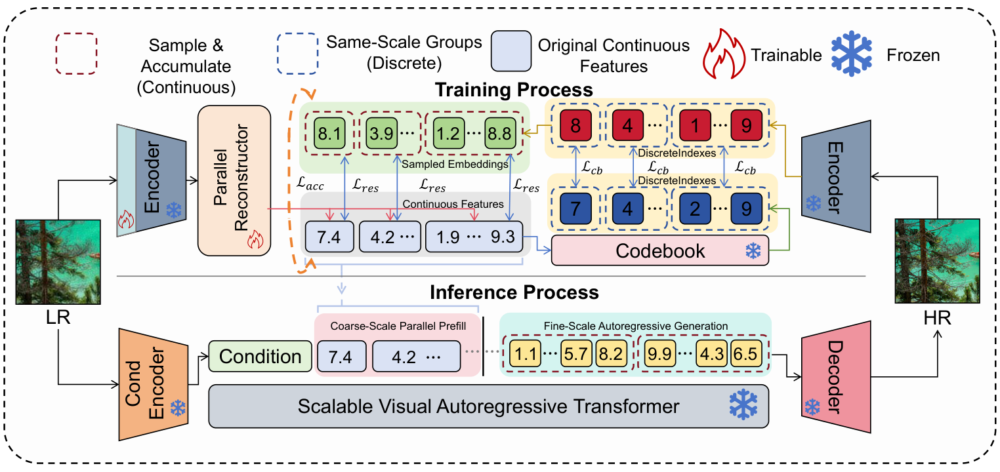

# K2NSR: Detail Continuation over a Trustworthy Coarse Scale for Autoregressive Super-Resolution


[](https://arxiv.org/abs/2608.01823)



Hallucination remains a persistent challenge in generative super-resolution, where restored images may contain plausible details, structural deviations, or textures that are weakly supported by the low-resolution input. Visual autoregressive modeling offers an explicit coarse-to-fine generation interface, but existing autoregressive SR methods still follow the full 1-to-N generation path. We propose **K2N**, which reformulates this process as **k-to-N detail continuation**. A **Parallel Reconstructor** directly establishes early coarse-scale states from the LR image, and the frozen pretrained VAR Transformer continues the remaining finer scales. This design anchors reliable coarse structures to LR evidence while preserving generative flexibility for uncertain fine details. Experiments show competitive performance on standard SR metrics and clearer improvements in hallucination-focused evaluation. Our paper is available at [arXiv:2608.01823](https://arxiv.org/abs/2608.01823).

---

## Directory layout

Run all commands from the repository root unless noted otherwise.

```text
K2NSR/
|-- configs/
|   `-- k2nsr.json                     # Experiment configuration
|-- models/
|   |-- k2nsr/                        # Parallel Reconstructor, losses, and checkpoint loading
|   |-- var.py                        # Visual autoregressive backbone
|   `-- vqvae.py                      # VAE tokenizer and decoder
|-- inference/                        # Coarse-scale prefill and SR pipeline
|-- scripts/
|   |-- train_k2nsr.py                # Parallel Reconstructor training
|   `-- infer_k2nsr.py                # Super-resolution inference
|-- dataloader/                       # Real-ESRGAN degradation
|-- assets/
|   `-- k2nsr_framework.png
`-- requirements.txt
```

## Data

**Training.** We use 1.6M HR patches of resolution 512 x 512, sampled from approximately 28K images from DF2K, OST, and Unsplash Lite. LR-HR pairs are synthesized with the Real-ESRGAN degradation pipeline.

| Dataset | Download |
| --- | --- |
| DIV2K (DF2K) | [Training HR images](https://data.vision.ee.ethz.ch/cvl/DIV2K/DIV2K_train_HR.zip) |
| Flickr2K (DF2K) | [Flickr2K](https://cv.snu.ac.kr/research/EDSR/Flickr2K.tar) |
| OST | [OST](https://openmmlab.oss-cn-hangzhou.aliyuncs.com/datasets/OST_dataset.zip) |
| Unsplash Lite | [Official dataset](https://github.com/unsplash/datasets) / [Lite download](https://unsplash.com/data/lite/latest) |

Place training HR images under `data/train/hr/`. For Unsplash Lite, retrieve images using the photo URLs in the official dataset.

**Testing.** We evaluate on DIV2K-Val, RealSR, and DRealSR. Please refer to [VARSR](https://github.com/quyp2000/VARSR#inference) for test-data preparation, and place LR images under `testset/{dataset}/LR/`.

## Checkpoints

Pretrained VARSR and VQVAE checkpoints can be downloaded from
[Hugging Face: qyp2000/VARSR](https://huggingface.co/qyp2000/VARSR).

| File | Description | Download |
| --- | --- | --- |
| `checkpoints/VQVAE.pth` | VAE tokenizer, shared codebook, and decoder | [VQVAE.pth](https://huggingface.co/qyp2000/VARSR/resolve/main/VQVAE.pth) |
| `checkpoints/VARSR.pth` | Pretrained autoregressive SR backbone | [VARSR.pth](https://huggingface.co/qyp2000/VARSR/resolve/main/VARSR.pth) |
| `checkpoints/k2nsr.pth` | Parallel Reconstructor and adapted LR encoder | [K2NSR.pth](https://huggingface.co/muzeerec/K2N/tree/main/K2NSR.pth) |

## Environment

```bash
conda create -n k2nsr python=3.10 -y
conda activate k2nsr
pip install -r requirements.txt
```

## Quick start

### 1. Parallel Reconstructor

**Training**

```bash
python scripts/train_k2nsr.py \
    --config configs/k2nsr.json \
    --hr-dir data/train/hr \
    --vae-checkpoint checkpoints/VQVAE.pth \
    --output-dir results/k2nsr
```

For paired training data, add `--lr-dir data/train/lr`. For distributed training, replace `python` with `torchrun --standalone --nproc_per_node=2`.

### 2. Super-resolution

**Inference** (using the pretrained Parallel Reconstructor checkpoint)

```bash
python scripts/infer_k2nsr.py \
    --config configs/k2nsr.json \
    --input-dir testset/DIV2K-Val/LR \
    --output-dir results/DIV2K-Val \
    --checkpoint checkpoints/k2nsr.pth \
    --vae-checkpoint checkpoints/VQVAE.pth \
    --var-checkpoint checkpoints/VARSR.pth \
    --num-prefill-scales 3 \
    --device cuda:0
```

The default setting prefills three coarse scales and generates 512 x 512 SR images. Training and generation settings can be modified in `configs/k2nsr.json`.

---

## Acknowledgements

This repository builds upon the following open-source projects. We thank their authors for sharing their work:

- **VAR** - Visual Autoregressive Modeling: Scalable Image Generation via Next-Scale Prediction (NeurIPS 2024); provides the next-scale prediction framework ([FoundationVision/VAR](https://github.com/FoundationVision/VAR)).
- **VARSR** - Visual Autoregressive Modeling for Image Super-Resolution (ICML 2025); provides our pretrained SR backbone and the foundation of this repository ([quyp2000/VARSR](https://github.com/quyp2000/VARSR)).
- **Real-ESRGAN** - Training Real-World Blind Super-Resolution with Pure Synthetic Data (ICCV Workshops 2021); provides the training degradation pipeline ([xinntao/Real-ESRGAN](https://github.com/xinntao/Real-ESRGAN)).
- **BasicSR** - Open-source image restoration toolbox ([XPixelGroup/BasicSR](https://github.com/XPixelGroup/BasicSR)).

## Citation

If you find this work useful, please consider citing:

```bibtex
@inproceedings{fang2026detail,
  title     = {Detail Continuation over a Trustworthy Coarse Scale for Autoregressive Super-Resolution},
  author    = {Fang, Hongyi and Wu, Jiahui and Yue, Yichen and Zhou, Benjia and Zeng, Dan},
  booktitle = {Proceedings of the 34th ACM International Conference on Multimedia (MM '26)},
  year      = {2026},
  doi       = {10.1145/3767308.3836176}
}
```

<div align="center">
<i>This repository is released under the <a href="LICENSE">MIT License</a>.</i>
</div>
